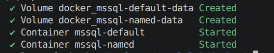
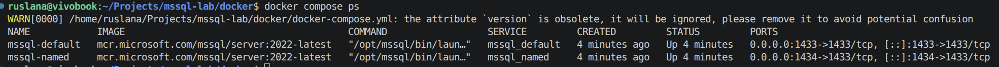

# Lab 01 — SQL Server Installation in Docker

## Objectives

- Deploy two Microsoft SQL Server instances in Docker containers
- Connect to both instances using the `sqlcmd` command‑line utility
- Retrieve basic instance metadata: version, edition, system databases and file locations
- Stop and start the default instance using Docker commands instead of GUI tools

## Original assignment

The original lab was designed for Hyper‑V and Windows Server.  
It required creating a virtual machine VM1, installing a default SQL Server 2012 Database instance, installing a second (named) instance, inspecting instance properties in SQL Server Management Studio, and stopping/starting the database engine from within SSMS.

## Docker / Linux adaptation

- The Hyper‑V VM is replaced by the Ubuntu host running Docker.
- The default instance is implemented as container `mssql-default` bound to port 1433 on the host
- The named instance is implemented as container `mssql-named` bound to port 1434 on the host
- Administration is performed using `sqlcmd` inside containers instead of SSMS
- Engine stop/start is performed using `docker compose stop/start` for the `mssql_default` service

## Environment setup

The two SQL Server containers are started with:

```bash
cd docker
docker compose up -d
docker compose ps
cd ..
```

After execution both `mssql-default` and `mssql-named` are in the **Up** state and listen on their respective ports.

<p align="center">
  
  <br>
  <em>Figure 1 — Starting both SQL Server containers.</em>
</p>

<p align="center">
  
  <br>
  <em>Figure 2 — Verifying container status with docker compose ps.</em>
</p>

If needed, all Docker and sqlcmd commands used in this lab are collected in `lab01_commands.md`.

## Steps performed

### Step 1 — Connect to the default instance and check metadata

The default instance is accessed via `sqlcmd` running inside the `mssql-default` container:

```bash
docker exec -it mssql-default /opt/mssql-tools18/bin/sqlcmd \
  -S localhost -U SA -P "Strong_Passw0rd!" -C
```

Inside the sqlcmd session the script `scripts/check_server_metadata.sql` was executed to query the server name, version, edition, list of databases and physical file locations for the `master` database.

### Step 2 — Connect to the named instance

The second instance is verified with an analogous connection:

```bash
docker exec -it mssql-named /opt/mssql-tools18/bin/sqlcmd \
  -S localhost -U SA -P "Strong_Passw0rd!" -C
```

The same metadata queries from `check_server_metadata.sql` are executed to confirm that a separate SQL Server instance is running with its own system databases and file paths.

### Step 3 — Stop and start the default instance

To emulate stopping and starting the database engine, the `mssql-default` container is controlled by Docker Compose:

```bash
cd docker
docker compose stop mssql_default
docker compose ps
docker compose start mssql_default
docker compose ps
cd ..
```

After `docker compose stop mssql_default`, connections via `sqlcmd` fail, and after `docker compose start mssql_default` the instance becomes reachable again.

## Scripts used

- `scripts/check_server_metadata.sql` — T‑SQL script that queries server metadata (server name, version, edition, system databases and master file locations).

All shell commands used in the lab are documented in `lab01_commands.md` for reproducibility.

## Conclusions

The installation lab was successfully adapted from a Hyper‑V + SSMS environment to a Docker + Ubuntu + sqlcmd workflow. Two independent SQL Server instances were deployed in containers, their metadata was validated using T‑SQL from a dedicated script, and basic engine lifecycle operations were performed using Docker commands only.

This demonstrates that essential SQL Server administration tasks can be practised in a fully containerized environment without relying on graphical tools, making the lab reproducible on any development machine with Docker installed.

## Assignment coverage checklist

1. VM creation in Hyper-V (CPU/RAM/HDD/Windows Server): adapted to Ubuntu host + Docker.
2. Default SQL Server instance installation: implemented as container `mssql-default`.
3. SSMS interface familiarization: adapted to `sqlcmd` CLI workflow.
4. Instance properties review: covered by metadata queries from `scripts/check_server_metadata.sql`.
5. Server stop/start from SSMS: adapted to `docker compose stop/start` for `mssql_default`.
6. Second named instance installation: implemented as container `mssql-named`.
7. Second instance configuration: verified by successful connection and metadata checks.
8. Connection via a dedicated port: implemented and validated through host port `1434` mapped to `mssql-named`.