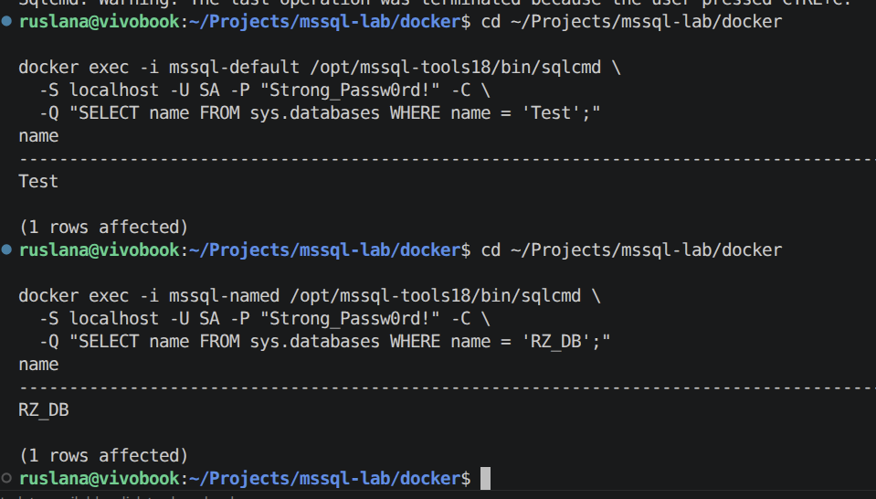
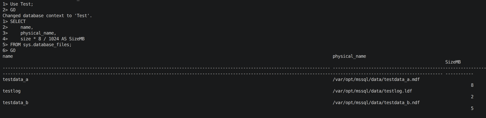
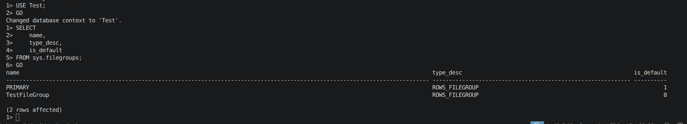

# Lab 02 — Database and File Management

## Objectives

- Create and configure SQL Server databases with multiple data files and filegroups
- Practice configuring file growth settings for data files
- Work with schemas and tables, including placing tables on a specific filegroup
- Repeat the same type of operations in a named instance using Transact‑SQL and Docker containers

## Original assignment

The original lab required creating the `Test` database in the default instance with a primary data file `testdata_a` (4 MB, autogrowth by 2 MB, maximum 10 MB), creating a secondary data file `testdata_b.ndf` (5 MB, autogrowth by 2 MB, unlimited size) and adding it to a new filegroup `TestFileGroup`.  
In the named instance a second database whose name contains the student’s initials (`RZ_DB` in this work) had to be created. Schemas and tables were to be created in both databases, including tables explicitly bound to a filegroup and tables in a schema not owned by the current user.

## Docker / Linux adaptation

- Default instance → container `mssql-default` (port 1433), where the `Test` database is created.
- Named instance → container `mssql-named` (port 1434), where `RZ_DB` is created.
- All operations are executed via `sqlcmd` inside containers using T‑SQL scripts instead of the SSMS graphical interface.

## Environment setup

The containers are assumed to be already running from Lab 01. If needed, they can be started with:

```bash
cd docker
docker compose up -d
docker compose ps
cd ..
```

All commands for this lab are collected in `lab02_commands.md` for reproducibility.

## Steps performed

### Step 1 — Create Test database and data files

The script `scripts/create_test_database.sql` was executed in the `mssql-default` container using `sqlcmd`.

It creates the `Test` database with:

- primary data file `testdata_a.mdf` (4 MB, autogrowth 2 MB, max 10 MB),
- log file `testlog.ldf` (2 MB, autogrowth 2 MB),
- filegroup `TestFileGroup`,
- secondary data file `testdata_b.ndf` (5 MB, autogrowth 2 MB, unlimited size) added to `TestFileGroup`.

<p align="center">
  
  <br>
  <em>Figure 1 — Creating Test and RZ_DB databases via sqlcmd.</em>
</p>

### Step 2 — Verify files and filegroups in Test

The script `scripts/verify_files_filegroups_and_tables.sql` was used with context set to `Test`.  
It queries `sys.database_files` and `sys.filegroups` to display file names, sizes, physical paths and filegroup metadata.

The result shows three files (`testdata_a.mdf`, `testlog.ldf`, `testdata_b.ndf`) with expected sizes and paths, and two filegroups: `PRIMARY` and `TestFileGroup`, with `PRIMARY` marked as the default filegroup.

<p align="center">
  
  <br>
  <em>Figure 2 — Data and log files for the Test database.</em>
</p>

<p align="center">
  
  <br>
  <em>Figure 3 — Filegroups PRIMARY and TestFileGroup in Test.</em>
</p>

### Step 3 — Create schemas and tables in Test

With `USE Test;`, the script `scripts/create_schemas_and_tables.sql` creates:

- schema `app` and tables `app.TABLE_1` (on default filegroup) and `app.TABLE_2` on `TestFileGroup`;
- schema `external` and table `external.TABLE_3`.

`TABLE_1` is created on the default filegroup, while `TABLE_2` explicitly targets `TestFileGroup` using the `ON TestFileGroup` clause.

### Step 4 — Create RZ_DB and objects in the named instance

In the `mssql-named` container, the script `scripts/create_rz_database.sql` creates the `RZ_DB` database with its own data and log files.

Then, with `USE RZ_DB;`, `scripts/create_schemas_and_tables.sql` creates schema `rz` and table `rz.MY_TABLE`.  
A verification query against `sys.tables` and `sys.schemas` confirms that `rz.MY_TABLE` exists in the `rz` schema.

## Scripts used

- `scripts/create_test_database.sql` — creates the `Test` database, primary and secondary data files, and the `TestFileGroup` filegroup.
- `scripts/create_rz_database.sql` — creates the `RZ_DB` database in the named instance.
- `scripts/create_schemas_and_tables.sql` — creates schemas `app`, `external`, `rz` and tables `TABLE_1`, `TABLE_2`, `TABLE_3`, `MY_TABLE`.
- `scripts/verify_files_filegroups_and_tables.sql` — verifies files, filegroups and table placement in `Test`.

All Docker and sqlcmd commands used to run these scripts are documented in `lab02_commands.md`.

## Conclusions

In this lab the `Test` database was created with a primary data file, a secondary data file and a dedicated filegroup `TestFileGroup`, matching the original specification for size and autogrowth settings. The configuration was validated using dynamic management views for database files and filegroups.

Custom schemas and tables were created in both `Test` and `RZ_DB`, including a table explicitly bound to a non‑default filegroup and a table in a schema that does not match the current user. All tasks were performed via T‑SQL and `sqlcmd` inside Docker containers, demonstrating that database and file management tasks from the original SSMS‑based lab can be fully reproduced in a containerized Linux environment.