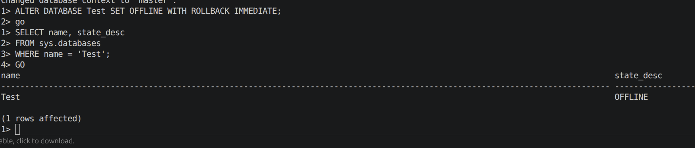
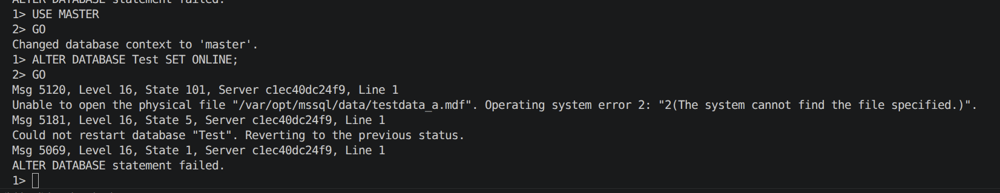

# Lab 03 — Backup and Recovery

## Objectives

- Practice creating full and log backups in SQL Server
- Restore a database after physical file corruption and logical errors using backups
- Copy a database between instances using backup and restore
- Understand database mirroring and database snapshots at the T‑SQL level
- Design a backup strategy for a real‑estate company and describe the recovery process after a server failure

## Original assignment

The original lab required the following tasks:

1. Before any other tasks, back up the `master` database to removable media.
2. Using the `Test` database from Lab 02:
   - create a backup of `Test`;
   - open the `Test` data file in a hex editor and modify several bytes;
   - attempt to connect to `Test`;
   - restore `Test` from the backup using `RESTORE`.
3. Repeat backup and restore operations, but use another server instance as the backup source.
4. Provide an example of configuring database mirroring for any database.
5. Provide an example of creating a snapshot of database `Test2` using Transact‑SQL.
6. Simulate a scenario using a transaction log backup:
   - display any table,
   - delete several rows,
   - return the database to its original state using backup and log backup.
7. Create a transaction log backup for `Test`, modify any object and restore `Test` to its original state.
8. For a real‑estate company with 5 working days and weekend reporting requirements, propose an optimal backup strategy and describe the recovery procedure if the primary server fails on Wednesday morning.

## Docker / sqlcmd adaptation

The lab is executed in Docker on Ubuntu. Two SQL Server instances are defined in `docker-compose`:

- `mssql-default` — default instance containing system databases (`master`, `msdb`, `tempdb`, `model`) and user database `Test` (from Lab 02).
- `mssql-named` — named instance containing `RZ_DB` and a database `Test_from_default` restored from a backup created on `mssql-default`.

The backup folder is:

- inside containers: `/var/opt/mssql/backups`;
- on the host: `docker/backups/` (mounted as a volume).

All actions are performed with `sqlcmd` inside containers:

```bash
docker exec -it <container-name> /opt/mssql-tools18/bin/sqlcmd \
  -S localhost -U SA -P "Strong_Passw0rd!" -C
```

Docker and `sqlcmd` commands used in this lab are collected in `lab03_commands.md`.

## Scripts overview

The following T‑SQL scripts are used in this lab:

- `scripts/backup_and_restore_in_default.sql` — full backup of `master` and `Test`, OFFLINE/ONLINE scenario for `Test` and restore from full backup on `mssql-default`.
- `scripts/copy_test_to_named_instance.sql` — backup of `Test` on `mssql-default` and restore as `Test_from_default` on `mssql-named`.
- `scripts/log_backup.sql` — log backup scenario for `Test`: FULL + LOG backup, row deletion and recovery using full + log backups.
- `scripts/snapshot_and_mirroring_examples.sql` — conceptual T‑SQL examples for database mirroring and database snapshot for `Test2`.

## 1. Backup of master and Test (Task 1–2, part 1)

The script `backup_and_restore_in_default.sql` was executed on `mssql-default` using `sqlcmd`.  
First, a full backup of the system database `master` was created to `/var/opt/mssql/backups/master_full_1.bak`.

```sql
BACKUP DATABASE master
TO DISK = '/var/opt/mssql/backups/master_full_1.bak'
WITH INIT,
     NAME = 'Full backup of master',
     STATS = 10;
```

Then a full backup of user database `Test` was created to `/var/opt/mssql/backups/Test_full_1.bak`.

```sql
BACKUP DATABASE Test
TO DISK = '/var/opt/mssql/backups/Test_full_1.bak'
WITH INIT,
     NAME = 'Full backup of Test',
     STATS = 10;
```

These backups correspond to the requirement to back up `master` and `Test` before further experiments.

## 2. Simulated corruption of Test and restore (Task 2)

### 2.1. Taking Test OFFLINE and simulating corruption

To simulate data file corruption, the `Test` database was first taken offline:

```sql
ALTER DATABASE Test
SET OFFLINE WITH ROLLBACK IMMEDIATE;
```

<p align="center">
  
  <br>
  <em>Figure 1 — Test database set to OFFLINE state.</em>
</p>

The list of physical files for `Test` was obtained from `sys.master_files` to identify the primary data file:

```sql
SELECT
    name,
    physical_name
FROM sys.master_files
WHERE database_id = DB_ID('Test');
```

The primary data file `testdata_a.mdf` was then deleted inside the container using a shell command (simulating manual corruption in a file editor):

```bash
docker exec -it mssql-default bash
rm /var/opt/mssql/data/testdata_a.mdf
exit
```

### 2.2. Attempt to bring Test ONLINE and restore from backup

After file deletion, an attempt to bring `Test` ONLINE was made:

```sql
ALTER DATABASE Test SET ONLINE;
```

As expected, the command failed because the primary data file was missing, demonstrating that the database could not be brought online in a corrupted state.

<p align="center">
  
  <br>
  <em>Figure 2 — Attempt to bring corrupted Test ONLINE results in an error.</em>
</p>

The same script then restored the `Test` database from the previously created full backup:

```sql
RESTORE DATABASE Test
FROM DISK = '/var/opt/mssql/backups/Test_full_1.bak'
WITH REPLACE,
     STATS = 10;
```

A query against `sys.databases` confirmed that `Test` was back in the `ONLINE` state:

```sql
SELECT name, state_desc
FROM sys.databases
WHERE name = 'Test';
```

This completes the part of the assignment related to physical corruption and recovery of `Test` using a full backup.

## 3. Backup on default instance and restore on named instance

To demonstrate backup and restore using another instance as the source device, the script `copy_test_to_named_instance.sql` was used.

### 3.1. Backup of Test on mssql-default

On `mssql-default`, Part A of the script created a full backup `Test_full_for_named.bak`:

```sql
BACKUP DATABASE Test
TO DISK = '/var/opt/mssql/backups/Test_full_for_named.bak'
WITH INIT,
     NAME = 'Full backup of Test for named instance',
     STATS = 10;
```

### 3.2. Restore as Test_from_default on mssql-named

On `mssql-named`, Part B restored this backup under a new name `Test_from_default` with new physical file names:

```sql
RESTORE DATABASE Test_from_default
FROM DISK = '/var/opt/mssql/backups/Test_full_for_named.bak'
WITH MOVE 'testdata_a' TO '/var/opt/mssql/data/testdata_a_from_default.mdf',
     MOVE 'testlog'   TO '/var/opt/mssql/data/testlog_from_default.ldf',
     REPLACE,
     STATS = 10;
```

A query confirmed that `Test_from_default` existed and was online in the named instance:

```sql
SELECT name, state_desc
FROM sys.databases
WHERE name = 'Test_from_default';
```

This implements the requirement to repeat backup and restore using another server instance as the backup source.

## 4. Mirroring and snapshot examples (Task 4–5)

The script `snapshot_and_mirroring_examples.sql` provides conceptual T‑SQL examples for configuring database mirroring for `Test` and creating a snapshot of `Test2`.

### 4.1. Database mirroring example

The script shows how to create a database mirroring endpoint and configure partners:

```sql
CREATE ENDPOINT MirroringEndpoint
    STATE = STARTED
    AS TCP (LISTENER_PORT = 5022)
    FOR DATABASE_MIRRORING (ROLE = ALL);
GO

ALTER DATABASE Test SET RECOVERY FULL;
GO

ALTER DATABASE Test
SET PARTNER = 'TCP://principal-server:5022';
GO

ALTER DATABASE Test
SET PARTNER = 'TCP://mirror-server:5022';
GO

-- ALTER DATABASE Test
-- SET WITNESS = 'TCP://witness-server:5022';
```

In practice, this requires separate principal, mirror and witness servers, but the script illustrates the key T‑SQL statements used in mirroring configuration.

### 4.2. Database snapshot example for Test2

The same script shows how to create a database snapshot for `Test2`:

```sql
CREATE DATABASE Test2_Snapshot
ON
(
    NAME = N'Test2_data',
    FILENAME = N'/var/opt/mssql/data/Test2_Snapshot.ss'
)
AS SNAPSHOT OF Test2;
```

This satisfies the requirement to provide a Transact‑SQL example of creating a snapshot for `Test2`.

## 5. Log backup and logical error recovery (Task 6–7)

The script `log_backup.sql` models a logical error scenario and recovery using full and log backups.

### 5.1. Set FULL recovery and create full backup

First, the `Test` database is switched to the FULL recovery model:

```sql
ALTER DATABASE Test SET RECOVERY FULL;
```

Then a full backup is taken for the log scenario:

```sql
BACKUP DATABASE Test
TO DISK = '/var/opt/mssql/backups/Test_full_for_log.bak'
WITH INIT,
     NAME = 'Full backup of Test for log scenario',
     STATS = 10;
```

### 5.2. Log backup before the DELETE

A log backup is then taken to capture all transactions up to the point just before the DELETE operation:

```sql
BACKUP LOG Test
TO DISK = '/var/opt/mssql/backups/Test_log_1.trn'
WITH INIT,
     NAME = 'Log backup of Test before delete',
     STATS = 10;
```

### 5.3. Delete rows from a table

The script then switches context to `Test` and deletes several rows from `app.TABLE_1`:

```sql
USE Test;
GO

SELECT TOP (5) * FROM app.TABLE_1;
GO

DELETE TOP (5) FROM app.TABLE_1;
GO

SELECT COUNT(*) AS RowsAfterDelete
FROM app.TABLE_1;
GO
```

### 5.4. Restore from full and log backups

To recover the deleted rows, the script restores the full backup with `NORECOVERY`:

```sql
USE master;
GO

RESTORE DATABASE Test
FROM DISK = '/var/opt/mssql/backups/Test_full_for_log.bak'
WITH NORECOVERY,
     REPLACE,
     STATS = 10;
```

Then it restores the log backup with `RECOVERY`:

```sql
RESTORE LOG Test
FROM DISK = '/var/opt/mssql/backups/Test_log_1.trn'
WITH RECOVERY,
     STATS = 10;
```

Finally, it checks the row count in `app.TABLE_1`:

```sql
USE Test;
GO

SELECT COUNT(*) AS RowsAfterRestore
FROM app.TABLE_1;
GO
```

This demonstrates that transaction log backups can be used to recover from logical errors such as accidental row deletion.

## 6. Backup strategy for the real‑estate company (Task 8)

### 6.1. Requirements

The scenario describes a real‑estate company with the following conditions:

- Working days: Monday, Tuesday, Wednesday, Friday.
- Days off: Thursday and Sunday (weekends).
- Data about properties flows into the database continuously in real time.
- Data processing and reporting occur only on working days.
- Each working morning, a critical report is generated for the previous day.
- The Friday and Sunday reports include data accumulated during the weekend.

### 6.2. Proposed backup strategy

Taking into account the need for point‑in‑time recovery (as exercised in Task 7.1) and minimal recovery time, the following strategy is proposed:

- **Full backups:**
  - Sunday night → base for the week.
  - Thursday night → base for Friday and the weekend.
- **Differential backups:**
  - Monday night → based on Sunday full.
  - Tuesday night → based on Sunday full.
- **Transaction log backups:**
  - Every 15–30 minutes during working hours.
  - Every 1–2 hours during weekends.

This schedule minimises the number of files required for restore (one full, the latest differential and a small chain of log backups) while still allowing point‑in‑time recovery using transaction logs as in Task 7.1.

### 6.3. Recovery after Wednesday‑morning failure

If the primary server fails on Wednesday morning before the Tuesday report is generated, the following backups are available:

- Full backup from Sunday night.
- Differential backups from Monday and Tuesday nights.
- Log backups for Tuesday and early Wednesday.

The recovery process on a new server is:

1. Install and configure a new SQL Server instance.
2. Restore the Sunday full backup with `NORECOVERY`.
3. Restore the latest differential backup (Tuesday night) with `NORECOVERY`.
4. Restore all transaction log backups taken after the Tuesday differential, up to the last backup taken before the failure time (using `STOPAT` if necessary).
5. Run the final `RESTORE LOG` with `RECOVERY` to bring the database online.
6. Generate the Tuesday report from the restored data.

This algorithm uses the same mechanisms as in Task 7.1 (full + log backups and point‑in‑time recovery) and provides an optimal balance between backup overhead and recovery time.