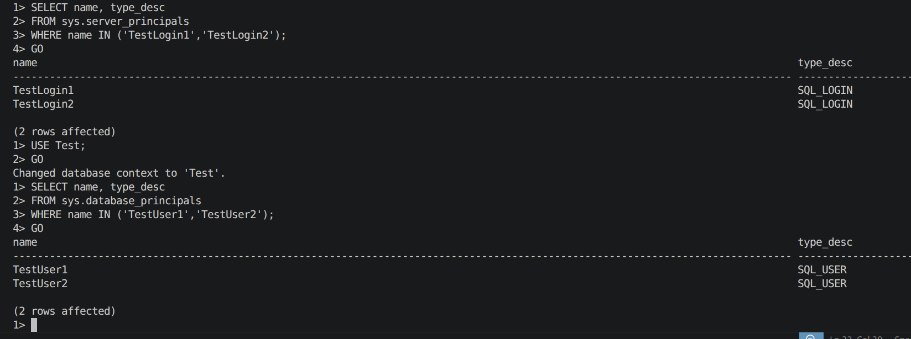
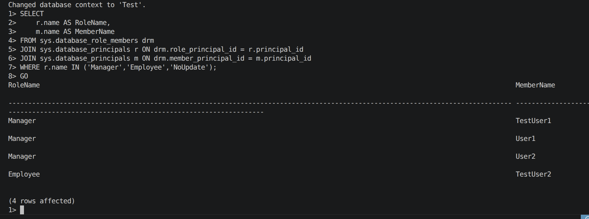
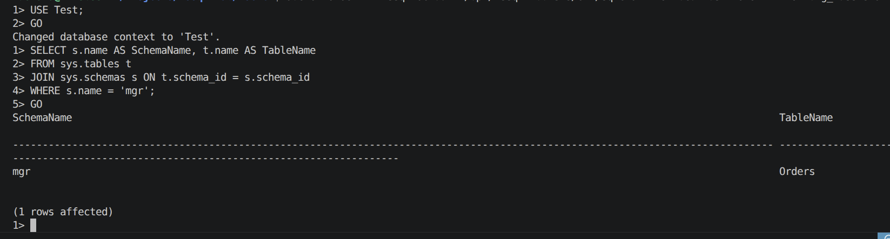
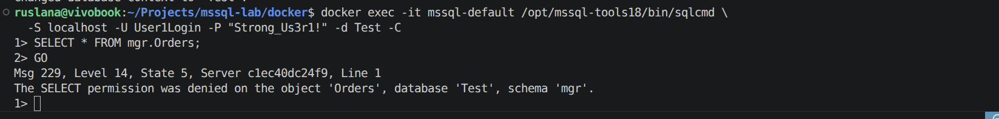

# Lab 04 — Security Management

## Objectives

- Learn how to manage security in Microsoft SQL Server at the level of logins, database users and roles
- Create SQL Server logins and associate them with database users
- Configure custom roles, permissions, and explicit denials for specific objects
- Practise working with Transact‑SQL and the `sqlcmd` utility in a Docker environment

## Original assignment

The original lab assignment required the following tasks:

1. Create a database `Test` for the exercises.
2. Change the server authentication mode to Mixed (Windows + SQL Server Authentication). In the Linux Docker environment this requirement is adapted to SQL Server Authentication with SQL logins, because Windows authentication is not used in the containerized setup.
3. Create SQL login `TestLogin1` with a password:
   - add `TestLogin1` to the fixed server role `sysadmin`;
   - set database `Test` as the default database for `TestLogin1`.
4. Create SQL login `TestLogin2` and database users in `Test`:
   - `TestUser1` mapped to `TestLogin1`;
   - `TestUser2` mapped to `TestLogin2`.
5. In database `Test`:
   - create roles `Manager` and `Employee`;
   - assign role `Manager` to `TestUser1`;
   - assign role `Employee` to `TestUser2`;
   - deny `Employee` the ability to alter the `guest` user;
   - create another role and deny it the ability to update tables.
6. Task 4.1: create a table in a new schema in `Test` owned by user `TestUser1` (Transact‑SQL).
7. Task 4.2: create users `User1` and `User2` in `Test`, add them to role `Manager`, and by several methods deny them selecting data from the table created in Task 4.1.

## Environment and setup

The lab is executed in Docker on Ubuntu. The default SQL Server instance is provided by the `mssql-default` container, which hosts the `Test` database created in earlier labs.

The Linux Docker container uses SQL Server Authentication, so SQL Server logins (`TestLogin1`, `TestLogin2`, etc.) can be created and used.

All scripts are stored under `labs/04-security/scripts/` in the project and are mounted into the container as `/var/opt/mssql/scripts/04-security/scripts/`.  
Connections are made with `sqlcmd` as the `SA` login:

```bash
docker exec -it mssql-default /opt/mssql-tools18/bin/sqlcmd \
  -S localhost -U SA -P "Strong_Passw0rd!" -C
```

The main T‑SQL scripts used in this lab are:

- `scripts/create_logins_and_users.sql`
- `scripts/create_roles_and_permissions.sql`
- `scripts/create_mgr_schema_and_orders_table.sql`
- `scripts/create_manager_users_and_deny_select.sql`.

Docker and `sqlcmd` commands for running these scripts are listed in `lab04_commands.md`.

## 1. Logins TestLogin1, TestLogin2 and users TestUser1, TestUser2

### 1.1. Creating logins and users

The script `create_logins_and_users.sql` performs the following actions:

- In `master`:
  - creates logins `TestLogin1` and `TestLogin2` with SQL Server Authentication and passwords;
  - adds `TestLogin1` to the server role `sysadmin`;
  - sets `Test` as the default database for `TestLogin1`.
- In `Test`:
  - creates database users `TestUser1` (for `TestLogin1`) and `TestUser2` (for `TestLogin2`).

Key fragment:

```sql
USE master;
GO

IF NOT EXISTS (SELECT 1 FROM sys.server_principals WHERE name = N'TestLogin1')
BEGIN
    CREATE LOGIN TestLogin1
    WITH PASSWORD = N'Strong_T3stLogin1!',
         CHECK_POLICY = OFF;
END;
GO

ALTER SERVER ROLE sysadmin ADD MEMBER TestLogin1;
GO

ALTER LOGIN TestLogin1
WITH DEFAULT_DATABASE = Test;
GO

IF NOT EXISTS (SELECT 1 FROM sys.server_principals WHERE name = N'TestLogin2')
BEGIN
    CREATE LOGIN TestLogin2
    WITH PASSWORD = N'Strong_T3stLogin2!',
         CHECK_POLICY = OFF;
END;
GO

USE Test;
GO

IF NOT EXISTS (SELECT 1 FROM sys.database_principals WHERE name = N'TestUser1')
BEGIN
    CREATE USER TestUser1 FOR LOGIN TestLogin1;
END;
GO

IF NOT EXISTS (SELECT 1 FROM sys.database_principals WHERE name = N'TestUser2')
BEGIN
    CREATE USER TestUser2 FOR LOGIN TestLogin2;
END;
GO
```

The script is executed from the host using `sqlcmd` inside the container and the `SA` login.

### 1.2. Verification

To verify that the logins and users were created, the following queries were executed:

```sql
SELECT name, type_desc
FROM sys.server_principals
WHERE name IN ('TestLogin1','TestLogin2');
GO

USE Test;
GO

SELECT name, type_desc
FROM sys.database_principals
WHERE name IN ('TestUser1','TestUser2');
GO
```

The output shows `TestLogin1` and `TestLogin2` as `SQL_LOGIN` and `TestUser1` and `TestUser2` as `SQL_USER`, confirming that the mapping between logins and users is correct.

<p align="center">
  
  <br>
  <em>Figure 1 — Logins TestLogin1, TestLogin2 and users TestUser1, TestUser2 created successfully.</em>
</p>

## 2. Database roles Manager, Employee and NoUpdate

### 2.1. Creating roles and assigning users

The script `create_roles_and_permissions.sql` creates the database roles `Manager`, `Employee` and `NoUpdate` in `Test` and assigns the existing users:

- `TestUser1` is added to role `Manager`;
- `TestUser2` is added to role `Employee`.

It also implements permission restrictions:

- `DENY ALTER ON USER::guest TO Employee` — members of `Employee` cannot alter the `guest` user;
- `DENY UPDATE TO NoUpdate` — members of `NoUpdate` cannot perform `UPDATE` statements on tables in the database.

Key fragment:

```sql
USE Test;
GO

IF NOT EXISTS (SELECT 1 FROM sys.database_principals WHERE name = N'Manager' AND type = 'R')
BEGIN
    CREATE ROLE Manager;
END;
GO

IF NOT EXISTS (SELECT 1 FROM sys.database_principals WHERE name = N'Employee' AND type = 'R')
BEGIN
    CREATE ROLE Employee;
END;
GO

ALTER ROLE Manager ADD MEMBER TestUser1;
GO

ALTER ROLE Employee ADD MEMBER TestUser2;
GO

IF NOT EXISTS (SELECT 1 FROM sys.database_principals WHERE name = N'NoUpdate' AND type = 'R')
BEGIN
    CREATE ROLE NoUpdate;
END;
GO

DENY UPDATE TO NoUpdate;
GO

DENY ALTER ON USER::guest TO Employee;
GO
```

### 2.2. Verification

Role membership was verified with:

```sql
USE Test;
GO

SELECT
    r.name AS RoleName,
    m.name AS MemberName
FROM sys.database_role_members drm
JOIN sys.database_principals r ON drm.role_principal_id = r.principal_id
JOIN sys.database_principals m ON drm.member_principal_id = m.principal_id
WHERE r.name IN ('Manager','Employee','NoUpdate');
GO
```

The result shows `TestUser1` as a member of `Manager` and `TestUser2` as a member of `Employee`.

<p align="center">
  
  <br>
  <em>Figure 2 — Users TestUser1 and TestUser2 assigned to roles Manager and Employee in Test.</em>
</p>

The deny statements (`DENY UPDATE TO NoUpdate`, `DENY ALTER ON USER::guest TO Employee`) are demonstrated conceptually and can be tested by attempting `UPDATE` operations or `ALTER USER guest` under accounts that belong to these roles.

## 3. New schema and table for TestUser1 (Task 4.1)

Task 4.1 requires creating a table in a new schema owned by `TestUser1`.  
The script `create_mgr_schema_and_orders_table.sql` implements this requirement:

- creates schema `mgr` with authorization `TestUser1`;
- creates table `mgr.Orders` in this schema.

```sql
USE Test;
GO

IF NOT EXISTS (SELECT 1 FROM sys.schemas WHERE name = N'mgr')
BEGIN
    EXEC('CREATE SCHEMA mgr AUTHORIZATION TestUser1;');
END;
GO

IF OBJECT_ID(N'mgr.Orders', N'U') IS NULL
BEGIN
    CREATE TABLE mgr.Orders
    (
        OrderId   INT IDENTITY(1,1) PRIMARY KEY,
        OrderDate DATETIME2     NOT NULL DEFAULT SYSDATETIME(),
        Amount    DECIMAL(10,2) NOT NULL
    );
END;
GO
```

Verification query:

```sql
USE Test;
GO

SELECT s.name AS SchemaName, t.name AS TableName
FROM sys.tables t
JOIN sys.schemas s ON t.schema_id = s.schema_id
WHERE s.name = 'mgr';
GO
```

<p align="center">
  
  <br>
  <em>Figure 3 — Table mgr.Orders created in the mgr schema owned by TestUser1.</em>
</p>

This confirms that a new schema and table owned by `TestUser1` have been created, satisfying Task 4.1.

## 4. Users User1, User2 and denying SELECT on mgr.Orders (Task 4.2)

### 4.1. Creating logins and users, adding them to Manager

The script `create_manager_users_and_deny_select.sql` first creates additional logins and database users:

- in `master`:
  - logins `User1Login` and `User2Login`;
- in `Test`:
  - users `User1` and `User2` mapped to `User1Login` and `User2Login`;
- both `User1` and `User2` are added to the `Manager` role.

```sql
USE master;
GO

IF NOT EXISTS (SELECT 1 FROM sys.server_principals WHERE name = N'User1Login')
BEGIN
    CREATE LOGIN User1Login
    WITH PASSWORD = N'Strong_Us3r1!',
         CHECK_POLICY = OFF;
END;
GO

IF NOT EXISTS (SELECT 1 FROM sys.server_principals WHERE name = N'User2Login')
BEGIN
    CREATE LOGIN User2Login
    WITH PASSWORD = N'Strong_Us3r2!',
         CHECK_POLICY = OFF;
END;
GO

USE Test;
GO

IF NOT EXISTS (SELECT 1 FROM sys.database_principals WHERE name = N'User1')
BEGIN
    CREATE USER User1 FOR LOGIN User1Login;
END;
GO

IF NOT EXISTS (SELECT 1 FROM sys.database_principals WHERE name = N'User2')
BEGIN
    CREATE USER User2 FOR LOGIN User2Login;
END;
GO

ALTER ROLE Manager ADD MEMBER User1;
GO

ALTER ROLE Manager ADD MEMBER User2;
GO
```

### 4.2. Denying SELECT in two ways

To fulfil Task 4.2 (“several ways, including T‑SQL”) the script implements two different mechanisms to deny `SELECT` on `mgr.Orders` for `User1` and `User2`:

1. Direct `DENY SELECT` on the table for each user:

   ```sql
   DENY SELECT ON OBJECT::mgr.Orders TO User1;
   GO

   DENY SELECT ON OBJECT::mgr.Orders TO User2;
   GO
   ```

2. Role‑based denial via an additional role `NoSelectMgrOrders`:

   ```sql
   IF NOT EXISTS (SELECT 1 FROM sys.database_principals WHERE name = N'NoSelectMgrOrders' AND type = 'R')
   BEGIN
       CREATE ROLE NoSelectMgrOrders;
   END;
   GO

   DENY SELECT ON OBJECT::mgr.Orders TO NoSelectMgrOrders;
   GO

   ALTER ROLE NoSelectMgrOrders ADD MEMBER User1;
   GO

   ALTER ROLE NoSelectMgrOrders ADD MEMBER User2;
   GO
   ```

This demonstrates both user‑level and role‑level deny configurations for the same table.

### 4.3. Verification under User1 and User2

To verify that permissions are correctly denied, a connection was made as `User1Login`:

```bash
docker exec -it mssql-default /opt/mssql-tools18/bin/sqlcmd \
  -S localhost -U User1Login -P "Strong_Us3r1!" -d Test -C
```

In the `sqlcmd` session the following query was executed:

```sql
SELECT * FROM mgr.Orders;
GO
```

The server returned a permission error similar to:

> The SELECT permission was denied on the object 'Orders', database 'Test', schema 'mgr'.

The same behaviour is observed when connecting as `User2Login`.

<p align="center">
  
  <br>
  <em>Figure 4 — User1 (in role Manager) is denied SELECT on mgr.Orders by explicit DENY and role-based DENY.</em>
</p>

This confirms that Task 4.2 is satisfied: users `User1` and `User2` belong to role `Manager` but are explicitly denied the ability to select data from the table created in Task 4.1 using multiple T‑SQL mechanisms.

## Conclusions

In this lab:

- SQL Server logins `TestLogin1` and `TestLogin2` were created with SQL Server Authentication, and database users `TestUser1` and `TestUser2` were created in `Test` and mapped to these logins.
- `TestLogin1` was added to the fixed server role `sysadmin`, and `Test` was set as its default database.
- Custom roles `Manager`, `Employee` and `NoUpdate` were created in `Test`, with appropriate membership and permission restrictions, including `DENY ALTER` on the `guest` user for `Employee` and `DENY UPDATE` for `NoUpdate`.
- A new schema `mgr` owned by `TestUser1` and a table `mgr.Orders` were created, meeting the requirements of Task 4.1.
- Additional users `User1` and `User2` were created and added to role `Manager`, and two different mechanisms (direct user‑level DENY and role‑based DENY) were used to deny them `SELECT` on `mgr.Orders`, fulfilling Task 4.2.
- All operations were performed using Transact‑SQL and the `sqlcmd` utility in a Docker‑hosted SQL Server instance, demonstrating that security administration tasks can be executed without SSMS.

## Assignment coverage checklist

1. Authentication mode + logins/users mapping:
  - The original Mixed-mode requirement is adapted to the Linux Docker setup by using SQL Server Authentication and SQL logins.
  - `TestLogin1`, `TestLogin2`, `TestUser1`, `TestUser2` are created and mapped.
  - `TestLogin1` is added to `sysadmin` and default DB is set to `Test`.
2. User roles and restrictions:
  - Roles `Manager` and `Employee` are created.
  - `TestUser1` assigned to `Manager`, `TestUser2` assigned to `Employee`.
  - `DENY ALTER ON USER::guest TO Employee` applied.
3. Additional role with denied updates:
  - Role `NoUpdate` created and `DENY UPDATE` applied.
4. Task 4.1 and 4.2:
  - Schema `mgr` owned by `TestUser1` and table `mgr.Orders` created.
  - Users `User1` and `User2` created, added to `Manager`.
  - `SELECT` denied on `mgr.Orders` by direct and role-based methods.