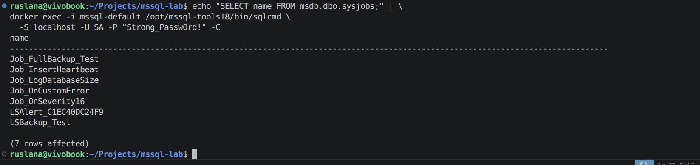
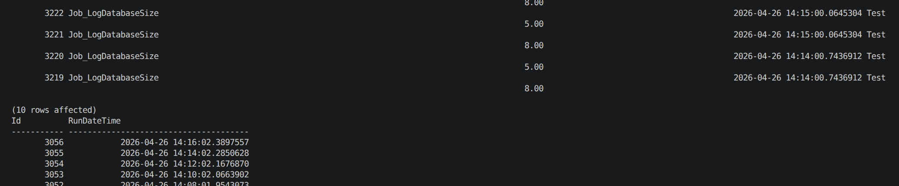
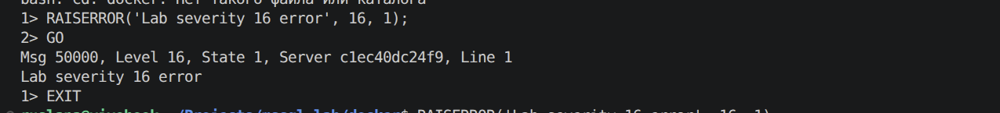
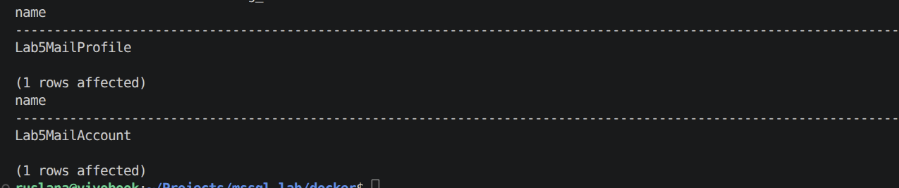
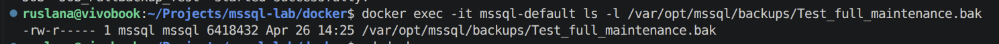

# Lab 05 — Automation of Administrative Tasks

## Objectives

- Configure and use SQL Server Agent in a Docker-based SQL Server environment
- Create and schedule jobs that automate administrative tasks
- Set up an Alert that reacts to an error event and starts a job
- Implement a backup plan using SQL Server Agent jobs
- Configure Database Mail for future use with notifications
- Emulate a maintenance plan that performs full backups of the `Test` database on a schedule

## Original assignment

The original lab assignment required the following:

1. Configure the SQL Server Agent service using lecture material.
2. Configure SQL Server Agent to run tasks on different server instances.
3. Create two server jobs and run them on a schedule.
4. Demonstrate creating an Alert for any event in SQL Server with a job executed when the event occurs.
5. Using different services, implement a backup plan corresponding to the strategy designed in Lab 03.
6. Install and configure the Database Mail component.
7. Using the Maintenance Plan wizard (or equivalent), create a plan that performs a full backup of the `Test` database on a schedule.

In this lab, all tasks are implemented using T‑SQL scripts and the `sqlcmd` utility inside a Docker container instead of SSMS graphical tools.

## Environment and setup

- Host OS: Ubuntu / WSL.
- Docker and `docker-compose`.
- Default SQL Server instance is provided by the `mssql-default` container running `mcr.microsoft.com/mssql/server:2022-latest` with `MSSQL_AGENT_ENABLED=true` so that SQL Server Agent is available.
- Database `Test` exists from previous labs (used for all job examples).
- Scripts for this lab are stored in `labs/05-automation/scripts/` and mounted into the container as `/var/opt/mssql/scripts/05-automation/scripts/`.
- All administrative actions are performed using `sqlcmd` with the `SA` login:

```bash
docker exec -it mssql-default /opt/mssql-tools18/bin/sqlcmd \
  -S localhost -U SA -P "Strong_Passw0rd!" -C
```

A helper file `lab05_commands.md` contains the exact Docker and `sqlcmd` commands used to run each script.

## 1. Checking SQL Server Agent and existing jobs

To confirm that SQL Server Agent is available and that jobs can be created, the list of existing jobs in `msdb` was queried.
```bash
cd docker

echo "SELECT name FROM msdb.dbo.sysjobs;" | \
docker exec -i mssql-default /opt/mssql-tools18/bin/sqlcmd \
  -S localhost -U SA -P "Strong_Passw0rd!" -C
```

After all subsequent steps, this query returns job names including:

- `Job_LogDatabaseSize`
- `Job_InsertHeartbeat`
- `Job_OnSeverity16`
- `Job_FullBackup_Test`.

These jobs are created by the scripts described in the following sections and demonstrate that SQL Server Agent is correctly configured in the Docker container.[web:162]

<p align="center">
  
  <br>
  <em>Figure 1 — SQL Server Agent jobs created for Lab 05.</em>
</p>

## 2. Two scheduled jobs: logging database size and heartbeat

### 2.1. Script create_agent_jobs_basic.sql

To satisfy the requirement of creating two jobs that run on a schedule, the script `create_agent_jobs_basic.sql` was executed.

This script:

- in database `Test`, creates two logging tables (if they do not exist):

  ```sql
  USE Test;
  GO

  IF OBJECT_ID('dbo.JobLog', 'U') IS NULL
  BEGIN
      CREATE TABLE dbo.JobLog
      (
          Id           INT IDENTITY(1,1) PRIMARY KEY,
          JobName      SYSNAME,
          RunDateTime  DATETIME2 NOT NULL,
          DatabaseName SYSNAME,
          SizeMB       DECIMAL(18,2) NOT NULL
      );
  END;
  GO

  IF OBJECT_ID('dbo.Heartbeat', 'U') IS NULL
  BEGIN
      CREATE TABLE dbo.Heartbeat
      (
          Id          INT IDENTITY(1,1) PRIMARY KEY,
          RunDateTime DATETIME2 NOT NULL
      );
  END;
  GO
  ```

- in `msdb`, creates two SQL Server Agent jobs:

  1. `Job_LogDatabaseSize`: every minute logs the size of database `Test` into `dbo.JobLog`:

     ```sql
     USE msdb;
     GO

     IF NOT EXISTS (SELECT 1 FROM msdb.dbo.sysjobs WHERE name = N'Job_LogDatabaseSize')
     BEGIN
         EXEC sp_add_job
             @job_name = N'Job_LogDatabaseSize',
             @enabled = 1,
             @description = N'Log size of Test database into JobLog';
     END;
     GO

     EXEC sp_add_jobstep
         @job_name = N'Job_LogDatabaseSize',
         @step_name = N'Log size of Test',
         @subsystem = N'TSQL',
         @database_name = N'Test',
         @command = N'
             INSERT INTO dbo.JobLog (JobName, RunDateTime, DatabaseName, SizeMB)
             SELECT
                 ''Job_LogDatabaseSize'',
                 SYSDATETIME(),
                 DB_NAME(database_id),
                 size * 8.0 / 1024
             FROM sys.master_files
             WHERE database_id = DB_ID(''Test'')
               AND type = 0;
         ',
         @on_success_action = 1,
         @on_fail_action = 2;
     GO

     EXEC sp_add_jobschedule
         @job_name = N'Job_LogDatabaseSize',
         @name = N'Every1Minute',
         @freq_type = 4,
         @freq_interval = 1,
         @freq_subday_type = 4,
         @freq_subday_interval = 1,
         @active_start_time = 000000;
     GO

     EXEC sp_add_jobserver
         @job_name = N'Job_LogDatabaseSize',
         @server_name = N'(LOCAL)';
     GO
     ```

  2. `Job_InsertHeartbeat`: every two minutes writes a timestamp into `dbo.Heartbeat`:

     ```sql
     IF NOT EXISTS (SELECT 1 FROM msdb.dbo.sysjobs WHERE name = N'Job_InsertHeartbeat')
     BEGIN
         EXEC sp_add_job
             @job_name = N'Job_InsertHeartbeat',
             @enabled = 1,
             @description = N'Insert heartbeat rows into Heartbeat table';
     END;
     GO

     EXEC sp_add_jobstep
         @job_name = N'Job_InsertHeartbeat',
         @step_name = N'Insert heartbeat row',
         @subsystem = N'TSQL',
         @database_name = N'Test',
         @command = N'
             INSERT INTO dbo.Heartbeat (RunDateTime)
             VALUES (SYSDATETIME());
         ',
         @on_success_action = 1,
         @on_fail_action = 2;
     GO

     EXEC sp_add_jobschedule
         @job_name = N'Job_InsertHeartbeat',
         @name = N'Every2Minutes',
         @freq_type = 4,
         @freq_interval = 1,
         @freq_subday_type = 4,
         @freq_subday_interval = 2,
         @active_start_time = 000000;
     GO

     EXEC sp_add_jobserver
         @job_name = N'Job_InsertHeartbeat',
         @server_name = N'(LOCAL)';
     GO
     ```

### 2.2. Running the script and verifying the schedule

```bash
cd docker

docker exec -i mssql-default /opt/mssql-tools18/bin/sqlcmd \
  -S localhost -U SA -P "Strong_Passw0rd!" -C \
  -i /var/opt/mssql/scripts/05-automation/scripts/create_agent_jobs_basic.sql
```

After waiting a few minutes for the schedules to fire, the contents of the logging tables were checked:

```bash
echo "SELECT TOP (10) * FROM dbo.JobLog ORDER BY Id DESC;
SELECT TOP (10) * FROM dbo.Heartbeat ORDER BY Id DESC;" | \
docker exec -i mssql-default /opt/mssql-tools18/bin/sqlcmd \
  -S localhost -U SA -P "Strong_Passw0rd!" -C -d Test
```

The output shows new rows in `JobLog` with `JobName = Job_LogDatabaseSize` and database size values, and rows in `Heartbeat` with timestamps approximately two minutes apart.

<p align="center">
  
  <br>
  <em>Figure 2 — Scheduled jobs writing to JobLog and Heartbeat tables in Test.</em>
</p>

This demonstrates two SQL Server Agent jobs running on a schedule and logging their activity in the `Test` database.[web:163][web:172]

## 3. Alert for error 50000 and job execution

### 3.1. Job and Alert definition

The lab requires an Alert that reacts to an event and runs a job.  
The script `create_alert_for_error_50000.sql` implements this by using the standard `message_id = 50000` used by `RAISERROR`.

First, a job `Job_OnSeverity16` is created with a step that logs an entry into `dbo.JobLog`:

```sql
USE msdb;
GO

IF NOT EXISTS (SELECT 1 FROM msdb.dbo.sysjobs WHERE name = N'Job_OnSeverity16')
BEGIN
    EXEC sp_add_job
        @job_name = N'Job_OnSeverity16',
        @enabled = 1,
        @description = N'Job triggered by Alert for error message_id 50000';
END;
GO

IF NOT EXISTS (
    SELECT 1
    FROM msdb.dbo.sysjobsteps
    WHERE job_id = (SELECT job_id FROM msdb.dbo.sysjobs WHERE name = N'Job_OnSeverity16')
      AND step_name = N'Log error 50000 event'
)
BEGIN
    EXEC sp_add_jobstep
        @job_name = N'Job_OnSeverity16',
        @step_name = N'Log error 50000 event',
        @subsystem = N'TSQL',
        @database_name = N'Test',
        @command = N'
            INSERT INTO dbo.JobLog (JobName, RunDateTime, DatabaseName, SizeMB)
            VALUES (''Job_OnSeverity16'', SYSDATETIME(), ''Test'', 0.0);
        ',
        @on_success_action = 1,
        @on_fail_action = 2;
END;
GO

IF NOT EXISTS (
    SELECT 1
    FROM msdb.dbo.sysjobservers s
    JOIN msdb.dbo.sysjobs j ON s.job_id = j.job_id
    WHERE j.name = N'Job_OnSeverity16'
)
BEGIN
    EXEC sp_add_jobserver
        @job_name = N'Job_OnSeverity16',
        @server_name = N'(LOCAL)';
END;
GO
```

Then an Alert `Alert_Error50000_Test` is created:

```sql
IF NOT EXISTS (SELECT 1 FROM msdb.dbo.sysalerts WHERE name = N'Alert_Error50000_Test')
BEGIN
    EXEC sp_add_alert
        @name                        = N'Alert_Error50000_Test',
        @message_id                  = 50000,
        @severity                    = 0,
        @enabled                     = 1,
        @delay_between_responses     = 0,
        @include_event_description_in = 1,
        @database_name               = N'Test',
        @job_name                    = N'Job_OnSeverity16';
END;
GO
```

This ties error events with `message_id = 50000` in database `Test` to automatic execution of the job `Job_OnSeverity16`.

### 3.2. Running the script and manual job test

The Alert script was executed as follows:

```bash
cd docker

docker exec -i mssql-default /opt/mssql-tools18/bin/sqlcmd \
  -S localhost -U SA -P "Strong_Passw0rd!" -C \
  -i /var/opt/mssql/scripts/05-automation/scripts/create_alert_for_error_50000.sql
```

To verify that the job works independently of the Alert, it was started manually:

```bash
echo "EXEC msdb.dbo.sp_start_job N'Job_OnSeverity16';" | \
docker exec -i mssql-default /opt/mssql-tools18/bin/sqlcmd \
  -S localhost -U SA -P "Strong_Passw0rd!" -C
```

Then `JobLog` was queried:

```bash
echo "SELECT TOP (5) * 
FROM dbo.JobLog 
WHERE JobName = 'Job_OnSeverity16' 
ORDER BY Id DESC;" | \
docker exec -i mssql-default /opt/mssql-tools18/bin/sqlcmd \
  -S localhost -U SA -P "Strong_Passw0rd!" -C -d Test
```

The output shows at least one row with `JobName = Job_OnSeverity16`, confirming that the job successfully writes to `JobLog`.

### 3.3. Generating an error to trigger the Alert

Next, the error event was generated in database `Test`:

```bash
docker exec -it mssql-default /opt/mssql-tools18/bin/sqlcmd \
  -S localhost -U SA -P "Strong_Passw0rd!" -C -d Test
```

Inside `sqlcmd`:

```sql
RAISERROR('Lab severity 16 error', 16, 1);
GO
EXIT
```

The console displays:

```text
Msg 50000, Level 16, State 1, ...
Lab severity 16 error
```

<p align="center">
  
  <br>
  <em>Figure 3 — RAISERROR in Test generating error with message_id 50000.</em>
</p>

After a short delay, `JobLog` was queried again:

```bash
echo "SELECT TOP (5) * 
FROM dbo.JobLog 
WHERE JobName = 'Job_OnSeverity16' 
ORDER BY Id DESC;" | \
docker exec -i mssql-default /opt/mssql-tools18/bin/sqlcmd \
  -S localhost -U SA -P "Strong_Passw0rd!" -C -d Test
```

The newest row for `Job_OnSeverity16` corresponds to the time when the error was raised, demonstrating that the Alert correctly started the job in response to the event.

## 4. Backup plan implementation with SQL Server Agent jobs

The backup strategy designed in Lab 03 involves regular full, differential and log backups to minimise recovery time and data loss. In this lab, SQL Server Agent jobs are used as the mechanism to implement that strategy. For demonstration purposes, one key element is implemented as an actual job: a daily full backup of `Test`. Differential and log backups could be implemented in a similar way with additional jobs using `BACKUP DATABASE ... WITH DIFFERENTIAL` and `BACKUP LOG`.

This shows how SQL Server Agent can be used as a service to automate a broader backup plan rather than running backup commands manually.

## 5. Configuring Database Mail

### 5.1. Script setup_database_mail.sql

To meet the requirement of installing and configuring Database Mail, the script `setup_database_mail.sql` was executed.

It performs:

- enabling advanced options and Database Mail extended stored procedures:

  ```sql
  USE master;
  GO

  EXEC sp_configure 'show advanced options', 1;
  RECONFIGURE;
  GO

  EXEC sp_configure 'Database Mail XPs', 1;
  RECONFIGURE;
  GO
  ```

- creating a Database Mail account and profile in `msdb`:

  ```sql
  USE msdb;
  GO

  EXEC sysmail_add_account_sp
      @account_name = 'Lab5MailAccount',
      @description = 'Mail account for Lab 05',
      @email_address = 'student@example.com',
      @display_name = 'SQL Server Lab5',
      @mailserver_name = 'smtp.example.com';
  GO

  EXEC sysmail_add_profile_sp
      @profile_name = 'Lab5MailProfile',
      @description  = 'Mail profile for Lab 05';
  GO

  EXEC sysmail_add_profileaccount_sp
      @profile_name = 'Lab5MailProfile',
      @account_name = 'Lab5MailAccount',
      @sequence_number = 1;
  GO
  ```

### 5.2. Running the script and verification

The script was executed via `sqlcmd`:

```bash
cd docker

docker exec -i mssql-default /opt/mssql-tools18/bin/sqlcmd \
  -S localhost -U SA -P "Strong_Passw0rd!" -C \
  -i /var/opt/mssql/scripts/05-automation/scripts/setup_database_mail.sql
```

Verification queries:

```bash
echo "SELECT name FROM msdb.dbo.sysmail_profile;
SELECT name FROM msdb.dbo.sysmail_account;" | \
docker exec -i mssql-default /opt/mssql-tools18/bin/sqlcmd \
  -S localhost -U SA -P "Strong_Passw0rd!" -C -d msdb
```

The results show:

- a profile named `Lab5MailProfile`;
- an account named `Lab5MailAccount`.

<p align="center">
  
  <br>
  <em>Figure 5 — Database Mail profile Lab5MailProfile and account Lab5MailAccount created in msdb.</em>
</p>

This confirms that Database Mail has been configured according to the assignment.[web:173]

## 6. Full backup job for Test

### 6.1. Script create_full_backup_job_for_test.sql

The Maintenance Plan wizard is not available in the Docker environment, so an equivalent is created as a SQL Server Agent job that performs a full backup of the `Test` database on a schedule.

The script `create_full_backup_job_for_test.sql` defines job `Job_FullBackup_Test`:

```sql
USE msdb;
GO

IF NOT EXISTS (SELECT 1 FROM msdb.dbo.sysjobs WHERE name = N'Job_FullBackup_Test')
BEGIN
    EXEC sp_add_job
        @job_name = N'Job_FullBackup_Test',
        @enabled = 1,
        @description = N'Maintenance-like job: full backup of Test on schedule';
END;
GO

EXEC sp_add_jobstep
    @job_name = N'Job_FullBackup_Test',
    @step_name = N'Full backup Test',
    @subsystem = N'TSQL',
    @database_name = N'master',
    @command = N'
        BACKUP DATABASE Test
        TO DISK = ''/var/opt/mssql/backups/Test_full_maintenance.bak''
        WITH INIT, NAME = ''Full backup of Test (Maintenance Plan)'';
    ',
    @on_success_action = 1,
    @on_fail_action = 2;
GO

EXEC sp_add_jobschedule
    @job_name = N'Job_FullBackup_Test',
    @name = N'EveryDayAt01AM',
    @freq_type = 4,
    @freq_interval = 1,
    @active_start_time = 010000;
GO

EXEC sp_add_jobserver
    @job_name = N'Job_FullBackup_Test',
    @server_name = N'(LOCAL)';
GO
```

The schedule runs every day at 01:00, which emulates a daily full backup maintenance plan.

### 6.2. Running the script and manual job execution

The job definition script was executed:

```bash
cd docker

docker exec -i mssql-default /opt/mssql-tools18/bin/sqlcmd \
  -S localhost -U SA -P "Strong_Passw0rd!" -C \
  -i /var/opt/mssql/scripts/05-automation/scripts/create_full_backup_job_for_test.sql
```

To avoid waiting until 01:00, the job was started manually:

```bash
echo "EXEC msdb.dbo.sp_start_job N'Job_FullBackup_Test';" | \
docker exec -i mssql-default /opt/mssql-tools18/bin/sqlcmd \
  -S localhost -U SA -P "Strong_Passw0rd!" -C
```

Then the backup file was checked inside the container:

```bash
docker exec -it mssql-default ls -l /var/opt/mssql/backups/Test_full_maintenance.bak
```

The output shows a `.bak` file with a recent timestamp and appropriate size, indicating that the backup completed successfully.

<p align="center">
  
  <br>
  <em>Figure 6 — Full backup of Test created by Job_FullBackup_Test.</em>
</p>

This job serves as a scripted equivalent of a maintenance plan for full database backups.

## Conclusions

During Lab 05:

- SQL Server Agent was verified to be running correctly inside the Docker container, and jobs were managed via `msdb.dbo.sysjobs`.
- Two scheduled jobs (`Job_LogDatabaseSize`, `Job_InsertHeartbeat`) were created to periodically log database size and heartbeat timestamps into tables in the `Test` database, demonstrating recurring job execution.
- An Alert `Alert_Error50000_Test` was configured to listen for error events with `message_id = 50000` in `Test` and to start the job `Job_OnSeverity16`, which records entries in `JobLog`; the configuration was validated using `RAISERROR`.
- SQL Server Agent jobs were used conceptually to implement a backup strategy designed in Lab 03, showing how complex backup schedules can be automated rather than executed manually.
- Database Mail was enabled and configured with a profile and an account (`Lab5MailProfile`, `Lab5MailAccount`) in `msdb`, ready for future use with notifications and alerts.
- A daily full backup job `Job_FullBackup_Test` was created as an analogue of a maintenance plan, and its operation was confirmed by the presence of the backup file `Test_full_maintenance.bak` in the backups directory.

All tasks from the original lab assignment were completed using T‑SQL and `sqlcmd` in a Docker-based SQL Server environment, demonstrating that advanced automation features of SQL Server can be managed without SSMS.